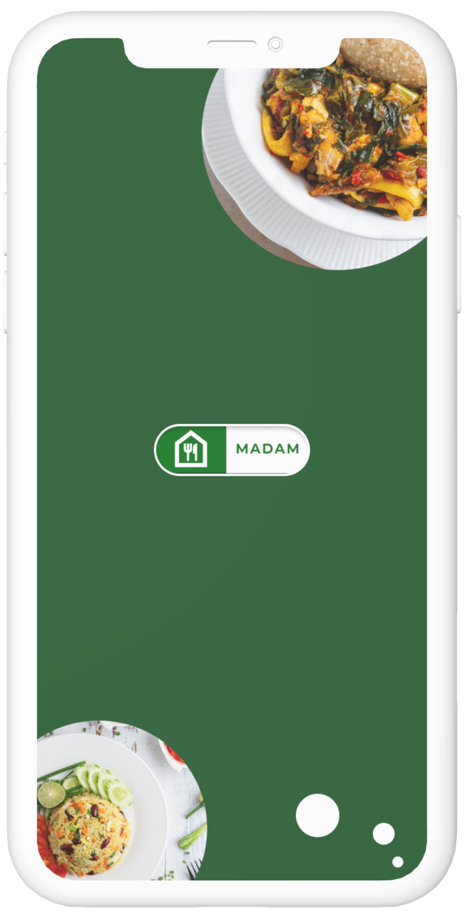

# Project Name
MADAM Food Ordering App

# About MADAM
MADAM is a food ordering app that aims to provide a user-friendly platform for easily ordering food and drinks from a mobile device, ensuring a seamless user experience. MADAM offers a convenient and efficient online ordering system for restaurants and cafes. By partnering with local businesses, MADAM helps these establishments reach a wider audience and increase their sales. Additionally, MADAM caters to individuals with health and dietary conditions, allowing them to customize their orders according to their preferences and specific needs.

# Description
A backend application for a food ordering app that handles the server-side functionality.

# Installation
  1. Clone the repository:
  git clone repository-url
 
  2. Navigate to the project directory:
  cd madam-food-app-backend

  3. Install dependencies:
  npm install

# Dependencies
- Express
- Morgan
- Cookie Parser
- Body Parser
- Mongoose
- Jsonwebtoken
- Validator
- Dotenv
- Nodemon

# Environment Configuration
  1. Create a .env file in the root directory of the project.
  2. Set the following environment variables in the .env file:
  PORT = port-number;
  DATABASE_URL = database-connection-url;
  JWT_SECRET = jwt-secret-key;
  
# Database Setup
  1. Create a new database for the application.

  2. Update the DATABASE_URL environment variable in the .env file with the connection URL of your database.

# Starting the Server
To start the backend server, run the following command:
  npm start
The server will start running on the specified port (configured via the PORT environment variable).

# Error Handling
The backend application includes a global error handling middleware to handle any unhandled errors. All errors are properly formatted and returned as JSON responses.

# Contributing
If you would like to contribute to this project, please follow the guidelines outlined in the CONTRIBUTING.md file.
